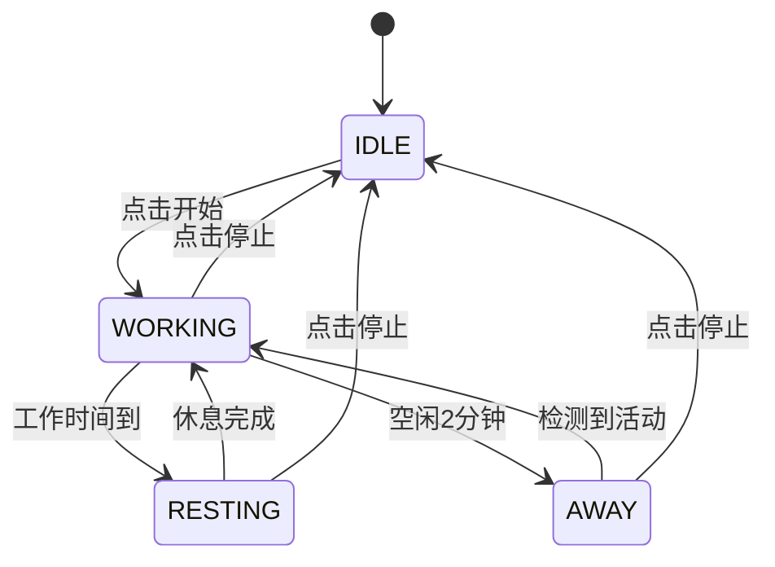

# 用户空闲检测功能实现计划

## 项目概述

为护眼助手添加用户空闲检测功能，当用户在工作状态下键盘和鼠标2分钟内没有活动时，重置计时器并暂停计时，确保用户长时间离开后回到电脑前处于可用状态。

## 当前架构分析

### 现有组件
- **EyeRestCore**: 核心业务逻辑，使用简单布尔值管理状态
- **RestManager**: 独立的休息管理器，处理休息期间的逻辑
- **MainFrame**: 主UI界面，通过回调与核心逻辑交互
- **Config**: JSON配置管理

### 现有状态管理问题
- 使用`is_running`和`is_working`布尔值组合管理状态
- 状态转换逻辑分散在不同方法中
- 缺乏用户活动检测机制

## 目标状态机设计

### 状态定义
```
IDLE    - 初始状态: 程序启动但未开始工作
WORKING - 工作状态: 正在工作计时
RESTING - 休息状态: 正在休息
AWAY    - 离开状态: 用户离开电脑（新增）
```

### 状态转换图


## 实现计划

### 第一阶段: 状态机基础架构

#### 1.1 创建状态枚举 (`src/lib/app_states.py`)
```python
from enum import Enum

class AppState(Enum):
    IDLE = "idle"           # 初始状态
    WORKING = "working"     # 工作状态  
    RESTING = "resting"     # 休息状态
    AWAY = "away"          # 离开状态
```

#### 1.2 重构 EyeRestCore 状态管理
**移除现有状态变量:**
- `self.is_running` 
- `self.is_working`

**新增状态管理:**
```python
from .app_states import AppState

class EyeRestCore:
    def __init__(self):
        # 状态机
        self.current_state = AppState.IDLE
        self.state_start_time = time.time()
        
        # 工作相关
        self.work_start_time = 0
        self.work_end_time = 0
        self.accumulated_work_time = 0  # 累计工作时间
        
        # 离开状态相关
        self.away_start_time = 0
```

#### 1.3 状态转换方法
```python
def _transition_to(self, new_state):
    """安全的状态转换"""
    old_state = self.current_state
    self.current_state = new_state
    self.state_start_time = time.time()
    
    # 状态进入处理
    self._on_state_enter(new_state)
    
    # 日志记录
    self.logger.info(f"状态转换: {old_state.value} → {new_state.value}")
    
    # 通知UI更新
    self._notify_status_change()

def _on_state_enter(self, state):
    """状态进入处理"""
    if state == AppState.WORKING:
        self.work_start_time = time.time()
        self.work_end_time = self.work_start_time + self.config.work_time * 60
    elif state == AppState.AWAY:
        self.away_start_time = time.time()
    elif state == AppState.IDLE:
        self._reset_timers()
```

### 第二阶段: 活动检测组件

#### 2.1 创建活动检测器 (`src/lib/activity_detector.py`)
```python
import ctypes
import ctypes.wintypes
import time

class ActivityDetector:
    """用户活动检测器，使用Windows API检测键盘鼠标活动"""
    
    def __init__(self):
        self.user32 = ctypes.windll.user32
        
    def get_last_input_time(self):
        """获取最后一次输入时间（毫秒）"""
        class LASTINPUTINFO(ctypes.Structure):
            _fields_ = [("cbSize", ctypes.wintypes.UINT),
                       ("dwTime", ctypes.wintypes.DWORD)]
        
        lii = LASTINPUTINFO()
        lii.cbSize = ctypes.sizeof(LASTINPUTINFO)
        
        if self.user32.GetLastInputInfo(ctypes.byref(lii)):
            return lii.dwTime
        return 0
    
    def get_idle_seconds(self):
        """获取空闲秒数"""
        last_input_time = self.get_last_input_time()
        current_time = ctypes.windll.kernel32.GetTickCount()
        return (current_time - last_input_time) // 1000
    
    def is_user_idle(self, threshold_seconds):
        """检查用户是否空闲超过阈值"""
        return self.get_idle_seconds() >= threshold_seconds
```

#### 2.2 集成到核心逻辑
```python
# 在 EyeRestCore.__init__ 中添加
from .activity_detector import ActivityDetector

def __init__(self):
    # ... 现有代码 ...
    self.activity_detector = ActivityDetector()
    self.idle_threshold = 120  # 2分钟
```

### 第三阶段: 定时器逻辑重构

#### 3.1 重写定时器函数
```python
def _timer_func(self):
    """状态机驱动的定时器函数"""
    while True:
        with self.thread_lock:
            if self.current_state == AppState.IDLE:
                time.sleep(0.5)
                continue
                
            # 根据当前状态执行不同逻辑
            if self.current_state == AppState.WORKING:
                self._handle_working_state()
            elif self.current_state == AppState.AWAY:
                self._handle_away_state()
            # RESTING状态由RestManager处理
                
        time.sleep(1)

def _handle_working_state(self):
    """处理工作状态逻辑"""
    current_time = time.time()
    
    # 检查是否空闲
    if self.activity_detector.is_user_idle(self.idle_threshold):
        self._transition_to(AppState.AWAY)
        return
    
    # 检查工作时间是否到达
    if current_time >= self.work_end_time:
        self._start_rest()
        return
    
    # 更新剩余时间显示
    self._update_work_display()

def _handle_away_state(self):
    """处理离开状态逻辑"""
    if not self.activity_detector.is_user_idle(self.idle_threshold):
        # 用户回来了，重新开始工作
        self._transition_to(AppState.WORKING)

def _start_rest(self):
    """开始休息"""
    self._transition_to(AppState.RESTING)
    if self.on_start_rest:
        wx.CallAfter(self.on_start_rest, self.config.rest_time)
```

### 第四阶段: 配置扩展

#### 4.1 更新配置文件 (`config.py`)
```python
class Config:
    def __init__(self):
        self.default_config = {
            # ... 现有配置 ...
            "idle_detection_enabled": True,
            "idle_threshold_minutes": 2,
        }
    
    def load(self):
        # ... 现有代码 ...
        self.idle_detection_enabled = config.get("idle_detection_enabled", 
                                                  self.default_config["idle_detection_enabled"])
        self.idle_threshold_minutes = config.get("idle_threshold_minutes", 
                                                  self.default_config["idle_threshold_minutes"])
```

#### 4.2 UI配置选项 (`main_window.py`)
```python
def _init_ui(self):
    # ... 现有代码 ...
    
    # 添加空闲检测配置
    grid.Add(wx.StaticText(panel, label="启用离开检测:"))
    self.idle_detection_checkbox = wx.CheckBox(panel)
    self.idle_detection_checkbox.SetValue(self.core.config.idle_detection_enabled)
    grid.Add(self.idle_detection_checkbox)
    
    grid.Add(wx.StaticText(panel, label="离开检测时间(分钟):"))
    self.idle_threshold_spin = wx.SpinCtrl(panel, value=str(self.core.config.idle_threshold_minutes))
    grid.Add(self.idle_threshold_spin)
```

### 第五阶段: UI状态显示优化

#### 5.1 状态显示文案
```python
def _get_status_text(self):
    """根据当前状态返回显示文案"""
    if self.current_state == AppState.IDLE:
        return "就绪"
    elif self.current_state == AppState.WORKING:
        remaining = int(self.work_end_time - time.time())
        if remaining > 0:
            return f"工作中: 还剩 {remaining//60}:{remaining%60:02d}"
        return "工作中"
    elif self.current_state == AppState.RESTING:
        return "休息时间"
    elif self.current_state == AppState.AWAY:
        away_duration = int(time.time() - self.away_start_time)
        return f"检测到用户离开 ({away_duration//60}:{away_duration%60:02d})"
    return "未知状态"
```

#### 5.2 托盘图标状态
```python
# 在 taskbar.py 中添加状态相关的图标显示
def update_icon_by_state(self, state):
    """根据状态更新托盘图标"""
    status_map = {
        AppState.IDLE: "就绪",
        AppState.WORKING: "工作中", 
        AppState.RESTING: "休息中",
        AppState.AWAY: "用户离开"
    }
    self.SetIcon(self.icon, f"护眼助手 - {status_map.get(state, '未知状态')}")
```

### 第六阶段: 向后兼容性

#### 6.1 保持现有API兼容
```python
# 为现有代码提供兼容性属性
@property
def is_running(self):
    """兼容性属性：是否正在运行"""
    return self.current_state != AppState.IDLE

@property  
def is_working(self):
    """兼容性属性：是否在工作状态"""
    return self.current_state == AppState.WORKING
```

#### 6.2 现有方法适配
```python
def start_work_session(self, work_time, rest_time, play_sound, allow_password):
    """开始工作会话 - 适配到状态机"""
    with self.thread_lock:
        # 更新配置
        self.config.work_time = work_time
        self.config.rest_time = rest_time
        self.config.play_sound_after_rest = play_sound
        self.config.allow_password_skip = allow_password
        self.config.save()
        
        # 启动定时器线程
        if not self.timer_thread.is_alive():
            self.timer_thread.start()
        
        # 转换到工作状态
        self._transition_to(AppState.WORKING)

def stop_work_session(self):
    """停止工作会话 - 适配到状态机"""
    with self.thread_lock:
        self._transition_to(AppState.IDLE)
```

## 测试计划

### 单元测试
1. **状态转换测试**: 验证所有合法的状态转换
2. **活动检测测试**: 模拟用户活动和空闲状态
3. **定时器逻辑测试**: 验证各状态下的定时器行为

### 集成测试  
1. **完整工作流程**: 启动 → 工作 → 休息 → 循环
2. **离开检测流程**: 工作 → 检测离开 → 用户返回 → 重新工作
3. **UI交互测试**: 按钮操作、状态显示、配置更新

### 用户验收测试
1. **正常使用场景**: 验证不影响现有功能
2. **离开场景**: 验证长时间离开后的用户体验
3. **配置场景**: 验证可以关闭/调整离开检测功能

## 风险评估与缓解

### 技术风险
- **Windows API兼容性**: 不同Windows版本的API差异
  - *缓解*: 添加异常处理和降级方案
- **性能影响**: 频繁的活动检测可能影响性能  
  - *缓解*: 使用适当的检测间隔，优化检测逻辑

### 用户体验风险
- **误判**: 用户未离开但被判断为离开
  - *缓解*: 提供可配置的阈值，默认值经过测试验证
- **学习成本**: 新增配置选项增加复杂度
  - *缓解*: 提供合理默认值，配置选项可选

## 实施时间线

- **第1-2阶段** (2天): 状态机基础架构和活动检测组件
- **第3阶段** (1天): 定时器逻辑重构  
- **第4-5阶段** (1天): 配置扩展和UI优化
- **第6阶段** (1天): 向后兼容性处理
- **测试阶段** (1天): 单元测试、集成测试和用户测试

**总计**: 约6个工作日

## 交付成果

1. **新增文件**:
   - `src/lib/app_states.py` - 状态定义
   - `src/lib/activity_detector.py` - 活动检测器

2. **修改文件**:
   - `src/lib/app_core.py` - 核心逻辑重构
   - `src/lib/config.py` - 配置扩展
   - `src/lib/main_window.py` - UI更新
   - `src/lib/taskbar.py` - 托盘状态显示

3. **文档**:
   - API文档更新
   - 用户使用说明
   - 开发者维护指南

## 后续优化方向

1. **智能学习**: 根据用户习惯自动调整空闲阈值
2. **统计功能**: 记录工作时间、离开次数等统计信息
3. **多显示器支持**: 优化多显示器环境下的活动检测
4. **跨平台支持**: 扩展到macOS和Linux系统
